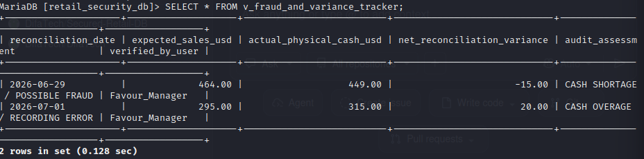

# Secured-Retail-DB
Secure Dual-Currency Retail Inventory & Audit System.

## 📌 Project Overview
In retail environments, data integrity and access control are critical to preventing internal fraud, ensuring accurate financial reporting, and tracking physical asset movement. 

This project simulates a robust, production-ready relational database schema designed for a high-volume mobile phone and accessories retail enterprise. It natively handles **dual-currency transactions** (USD and local currency) and implements strict financial data segregation between recorded sales and physical cash handling.

Crucially, the project is engineered with a **Security-First approach**, implementing data security, access limitations, and comprehensive audit logs to prevent unauthorized modifications or data manipulation.

---

## 🎯 Key Business & Security Features

### 1. Financial & Operational Logic
*   **Dual-Currency Synchronization:** Dynamically tracks product valuation, cost prices, and sales revenue across dual currencies based on active exchange rates.
*   **Cash vs. Revenue Segregation:** Distinctly separates payment methods (Physical Cash vs. Digital/Bank/Mobile Sales) to maintain clear ledger clarity.
*   **Automated Variance Reconciliation:** An audit table specifically designed to contrast expected system sales against physical cash counts, instantly calculating discrepancies or variances.

### 2. Defensive Security Implementation
*   **Role-Based Access Control (RBAC):** Simulates granular user permissions to enforce the principle of least privilege:
    *   `Sales_Clerk`: Granted permission *only* to input daily sales; restricted from viewing cost prices, changing historical logs, or accessing audit metrics.
    *   `Auditor / CEO`: Full access to variance reports, financial summaries, and system logs.
*   **Immutability Strategy (Anti-Fraud):** SQL rules designed to prevent the modification or deletion of finalized transaction logs. Any adjustments must be made as a new balancing entry rather than altering past history.
*   **Data Integrity Controls:** Utilizes explicit foreign key constraints and validation checks to prevent orphaned data or impossible values (e.g., negative stock or negative currency entries).

---

## 🏗️ Database Architecture (Schema Blueprint)

The database consists of the following foundational tables:
1.  **`products`**: Tracks device models, specifications, active stock quantities, minimum stock warning levels, and baseline cost prices.
2.  **`exchange_rates`**: Logs historical fluctuations between USD and the local currency to ensure retroactively accurate financial audits.
3.  **`sales_transactions`**: Records chronological customer transactions, items sold, unit prices, and explicit payment channels.
4.  **`daily_reconciliation`**: The central security-audit ledger where physical data counts are matched against digital records to flag anomalies.

---

## 🛠️ Tech Stack
*   **Database Engine:** SQL (MySQL / PostgreSQL compatible)
*   **Security Methodologies:** Least Privilege, Role Separation, Fraud Pattern Detection, Input Constraint Validation

---

## 🚀 How to Explore This Repository
1.  `/schema.sql`: Contains the core structural DDL scripts to instantiate the tables, primary keys, and constraint checks.
2.  `/security-roles.sql`: Features the RBAC script configuring specific user roles, access limitations, and database views.
3.  `/mock-data.sql`: Holds sanitized, non-sensitive sample datasets modeling realistic inventory flows and cash variance anomalies for testing.
---

## 🔍 Verification & Audit Results (Live Terminal Testing)

To validate the security controls and auditing engine of this database, testing was performed inside a **Kali Linux** environment utilizing a local **MariaDB/MySQL** instance.

### 1. Automated Fraud & Discrepancy Detection
Executing a query against the saved audit view `v_fraud_and_variance_tracker` instantly filters out balanced business days and flags internal financial variances for manager investigation.



### 2. Role-Based Access Control Enforced (Least Privilege Test)
Impersonating the low-privileged floor staff account (`sales_clerk`) and attempting to access the financial verification ledger or audit views triggers an immediate engine-level denial—confirming data segregation works flawlessly.

```text
MariaDB [retail_security_db]> SELECT * FROM v_fraud_and_variance_tracker;
ERROR 1142 (42000): SELECT command denied to user 'sales_clerk'@'localhost' for table 'retail_security_databes'. 'v_fraud_and_variance_tracker'
